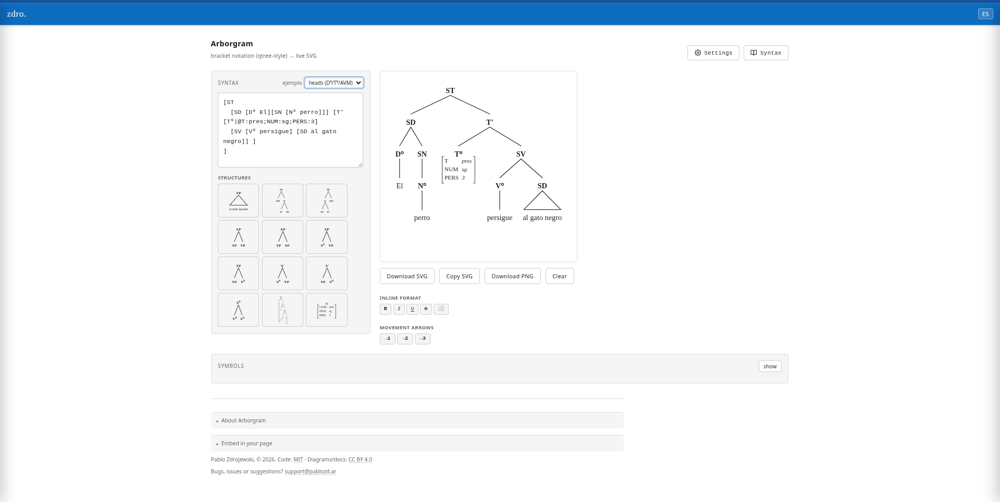

# Arborgram

[](https://arborgram.pablozd.ar)


**Arborgram** is a web-based syntax tree visualizer. It takes bracket notation as input and renders syntactic trees as SVG in real time.

Designed for teaching and research in generative syntax, morphology, and phonology. Available in Spanish and English.

→ **[arborgram.pablozd.ar](https://arborgram.pablozd.ar)**

## Demo

<p align="center">
  
</p>

## Screenshot

<p align="center">
  
</p>

## Features

- Single HTML file — no installation or backend required.
- Live SVG rendering as you type.
- Export as SVG or PNG.
- Copy SVG directly to clipboard.
- Spanish / English toggle.
- Serif and sans-serif typeface options.
- Configurable font size, row height, and horizontal spacing.
- Multiple branch rendering modes.

## Quick example

```txt
[SC [SN [Det El][N perro]] [SV [V persigue] [SN al gato negro]]]
```

## Local use

1. Download `index.html`.
2. Open it in any modern browser.
3. Type or paste a bracketed structure.
4. Export as SVG or PNG.

No compilation needed.

## Project structure

```txt
.
├── index.html
├── doc/
│   ├── arborgram-demo.gif
│   └── arborgram-screenshot.png
└── README.md
```

## License

Code: MIT · Diagrams/documentation: CC BY 4.0

© 2026 Pablo Zdrojewski — support@pablozd.ar
